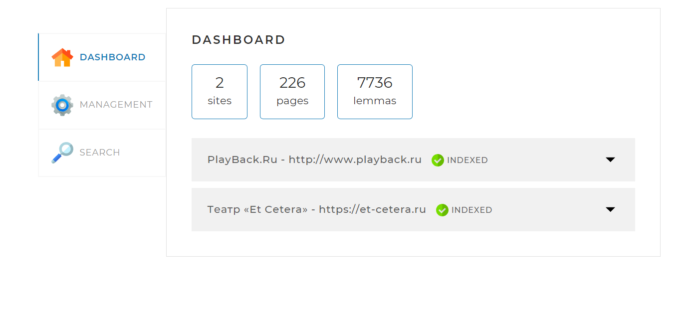

# localSearchEngine




Это учебный проект локального поискового движка по заданным сайтам. Движок предназначен для поиска страниц с информацией по ключевым словам и анализа сайтов.

## Оглавление
- [Технологии](#использованные-технологии)
- [Использование визуального интерфейса](#использование-визуального-интерфейса)
- [API](#api)
    - [Индексация](#индексация)
    - [Поиск](#поиск)
    - [Статистика](#статистика)
- [Контакты](#контакты)

## Использованные технологии

-  В проекте использован Spring Boot.
-  База данных: MySQL.
-  ORM: Hibernate.
-  Лемматизатор: Russian & English Morphology for Apache Lucene.

## Использование визуального интерфейса

1. Укажите сайты для индексации через конфигурационный файл **application.yaml** (не забудьте указать логин и пароль базы данных).
2. Запустите программу.
3. Перейдите во вкладку "**Managment**" и нажмите на кнопку "**Start indexing**".
4. После окончания процесса индексации статистическая информация станет доступна во вкладке "**Statistics**".
5. Для поиска используйте вкладку "**Search**", при использовании поиска есть возможность использовать ограничение на поиск по одному сайту.

[](src/main/resources/static/assets/img/icons/clip.gif)

## API

### Индексация
Доступные endpoints:

```html
GET /api/startIndexing -начать индексацию
```
```html
GET /api/stopIndexing -остановить индексацию
```
```html
POST /api/indexPage?url=URL страницы для добавления в индекс
```

### Поиск

```html
GET /api/search?query=тело запроса&site=ограничение на поиск внутри определенного сайта&offset=0&limit=10
```


### Статистика

```html
GET /api/statistics
```
Статистика выдается в виде JSON:
```JSON
{
  "result": true,
  "statistics": {
    "total": {
      "sites": 2,
      "pages": 230,
      "lemmas": 7759,
      "indexing": false
    },
    "detailed": [
      {
        "url": "http://www.playback.ru",
        "name": "PlayBack.Ru",
        "status": "INDEXED",
        "statusTime": 1692088027445,
        "error": "",
        "pages": 78,
        "lemmas": 1557
      },
      {
        "url": "https://et-cetera.ru",
        "name": "Театр «Et Cetera»",
        "status": "INDEXED",
        "statusTime": 1692088122082,
        "error": "",
        "pages": 152,
        "lemmas": 6202
      }
    ]
  }
}
```

### Контакты:
email: 79203430120@ya.ru
